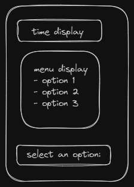
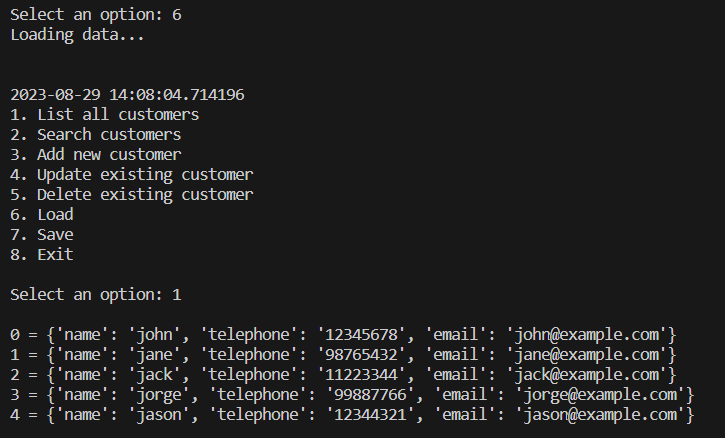
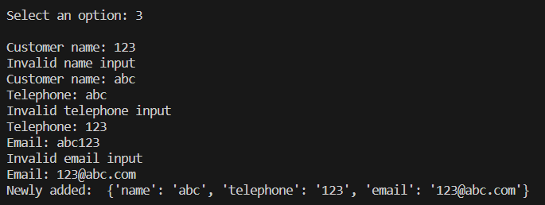

Simple CLI menu of a user registry/customer database.  
Users are able to perform basic CRUD (Create, Read, Update, Delete) functionality.

<h3>1.0 Software Requirements Specifications</h3>

FR 1: Feature One
Displaying customer information

FR 1.1: Feature One Expectation/Restraint
Upon selecting the "list all customers" option, users are able to view a list of saved customers.
Passable for a short list, but once the list grows, useability will suffer,
so that is something for future consideration.

FR 2: Feature Two
Updating customer information

FR 2.1: Feature Two Expectation/Restraint
Upon selecting the "update existing customer" option, users will be able to edit customer details.
There being only three fields at the moment makes it manageable, but for a full-fledged system,
doing so on a CLI might prove cumbersome.

FR 3: Feature Three
Data persistence

FR 3.1:
Since there is a need for customer details to be stored, data persistence is enabled.  
Just like with the first two points, a simple json file would suffice for now. Once it grows
beyond the scope of this project, alternative solutions might have to be explored.

2.0 Software Design
Being a CLI application, everything is text-based so that might not be for everyone.
On the other hand, it runs lean without complex requirements.

<h3>2.1 UI/UX Design</h3>

Menu mock-up:  

Final product:  

When an option is selected:  

<h3>2.2 Security Considerations</h3>  
Since it was beyond the scope of this project, user login was not implemented.  
That would be the first step to improve upon moving forward.  
Simple validation was also added to sanitize user input and provide a smooth
user experience. Tightening that up would also be another point of improvement.

<h3>3.0 Testing</h3>  
  

3.1 Unit Tests

3.11 Unit Test One  
Testing validation for adding a new entry.

Function Tested: Add new customer  
Name of Test (what to test for): input validation

Outcome 1  
Input: "123" into customer name field  
Expected Output: "invalid name input" notification

Outcome 2  
Input: "abc" into customer name field  
Expected output: passed validation

3.12 Unit Test Two  
Function Test: Delete existing customer  
Name of Test (what to test for): valid user input

Outcome 1  
Input: "5" into entry to delete field  
Expected Output: "invalid customer selected" notification

Outcome 2  
Input: any valid value (i.e. existing customer)  
Expected Output: "entry deleted successfully" notification

4.0 Future Enhancements
As mentioned above under the security section, some form of user login would be the
first thing to implement as an improvement.  
Next would be to tighten up the validation for user inputs since the current implementation
is pretty rudimentary but good enough to guard against simple input errors (e.g. keying in
an alphabet character into a number field).  
Improved search functionality to allow partial searches or for multiple filters is another
good improvement.
